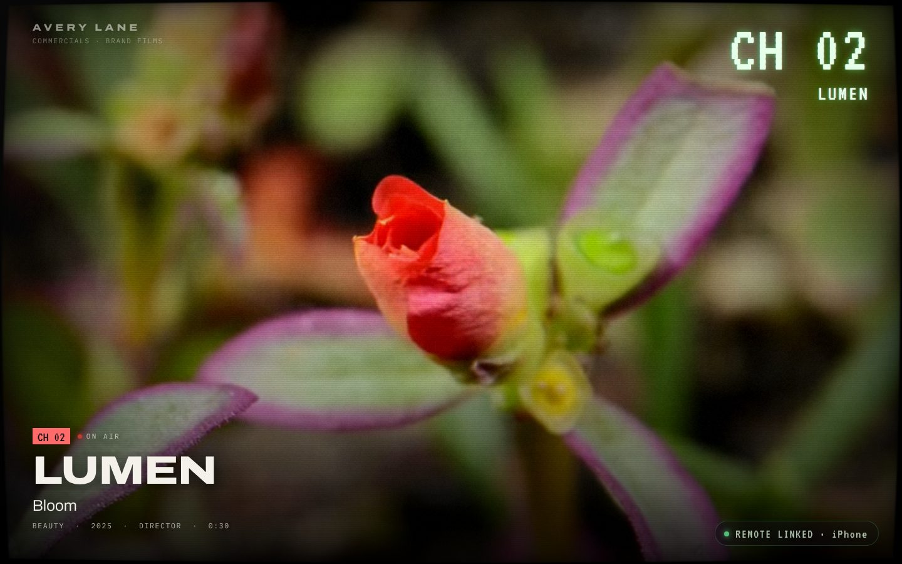
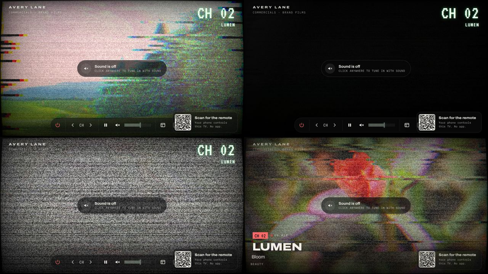
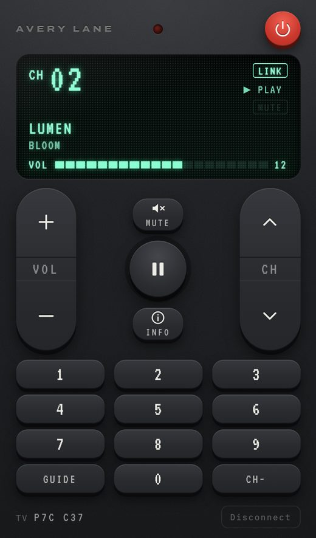

# Channel Surf: a portfolio that is a television

A portfolio site for a commercial / video advertising director. The whole site behaves like a
television: **each project is a channel**. Change channel and the picture breaks into analog snow,
rolls, and locks onto the next film. Scan the QR code in the corner and **your phone becomes the
remote control** for that screen, in real time, with no app.

Inspired by the interaction idea of Shopify's Winter '25 Edition "TV". This is an original
implementation; no branding, assets, copy or code are taken from it.



| Channel change, frame by frame | The phone remote |
| --- | --- |
|  |  |

---

## Quick start

Requirements: **Node 20.19+ or 22+**. Nothing else; no accounts, no API keys.

```bash
npm install
npm run dev
```

1. Open **http://localhost:5173** on your computer. The TV switches on and channel 01 plays (muted,
   until you click once, per browser autoplay rules).
2. Scan the QR code in the bottom-right corner with your phone's camera. The phone must be on the
   **same Wi-Fi**: in development the QR code points at your computer's LAN address (for example
   `http://192.168.1.20:5173/remote?session=K7QX2M`).
3. Your phone is now the remote. Press **CH ▲**.

`npm run dev` is a single process. The pairing relay (WebSocket) is mounted on Vite's own server, so
the site, the remote and the relay all share one port.

Production build and server:

```bash
npm run build
npm start            # http://localhost:3000, serves dist/ and the relay on the same port
```

> **Phone can't load the remote?** Check that both devices are on the same network, that your
> firewall allows incoming connections on port 5173 or 3000, and that the URL under the QR code
> isn't a `localhost` address. Corporate or guest Wi-Fi often isolates devices from each other. You
> can also open `/remote` on the phone and type the 6-character code shown on the TV.

---

## What's in the box

### The TV (desktop / tablet)

- **Full-viewport "screen"**: the browser window *is* the television. A WebGL shader adds a light
  CRT treatment: scanlines, grain, slight glass curvature, vignette and a hint of convergence error.
  It is deliberately subtle so the work stays watchable.
- **Channel change transition** (~560 ms): line tearing and RGB split, a black frame, full-screen
  snow with a vertical roll (the source switches underneath), then the picture locks back in. A
  synthesised burst of static plays when sound is on. Mashing channel-up stays in the snow and
  surfs, like a real set.
- **OSD**: `CH 03 / STILL` on every change (which then shrinks to a corner bug), the classic segmented
  volume bar, MUTE and PAUSE flags, direct-entry digits (`CH 0-`), NO SIGNAL, toasts for
  remote connect and disconnect.
- **Project lower-third**: brand, title and meta, typed in after each change, then out of the way.
  **INFO** adds the description and credits.
- **Guide (EPG)**: every channel with poster, plus the director's bio and contact details.
- **Power**: CRT switch-off (collapses to a line, then a fading dot) and warm-up, with sound.
- **Controls**: auto-hiding control strip with power, CH ‹ ›, play/pause, mute, volume, guide, phone
  remote and full screen. Plus the keyboard:

  | Key | Action | Key | Action |
  | --- | --- | --- | --- |
  | `↑` `→` `PgUp` | next channel | `0`–`9` | tune directly |
  | `↓` `←` `PgDn` | previous channel | `+` `−` | volume |
  | `M` | mute | `Space` `K` | play / pause |
  | `G` | guide | `I` | project info |
  | `R` | phone remote | `P` | power |
  | `F` | full screen | `Esc` | close |

- **Deep links**: `/?channel=4` opens on channel 4. The URL follows the channel.
- **Pre-buffering**: every channel has its own `<video>` element created up front. The current
  channel and its neighbours buffer first, then the rest in the background, so changes are instant.
  Each channel resumes where you left it, and loops.

### The phone remote (`/remote?session=CODE`)

- Looks and feels like a physical remote: graphite plastic, VFD display with unlit "ghost"
  segments, rubber keys that travel when pressed, rockers that tilt, and an IR LED that flashes on
  every transmission.
- Power, CH ▲▼, VOL +/−, mute, play/pause, info, a number pad with real-TV two-digit entry, and a
  **channel sheet** (GUIDE) for direct selection with thumbnails.
- Keys fire on touch-down (no 300 ms delay). VOL and CH auto-repeat while held.
- **Haptics**: the Vibration API on Android. On iOS 18+ (no Vibration API), it uses the system
  haptic tick of a hidden `<input type="checkbox" switch>`.
- The screen stays awake while in use (Screen Wake Lock API).
- Optimistic UI: presses show instantly, then reconcile with the TV's acknowledged state, so rapid
  presses never flicker backwards.
- Clear states: *linking*, *no signal, reconnecting*, *TV not found*, *standby*, *click the TV for
  sound*, *session ended*.
- Without a code (or after the TV ends the session) it shows a pairing screen with manual code
  entry.

### Phones visiting the main URL

They get a "portable TV" layout: a sticky 16:9 screen with the same shader and OSD, swipe to change
channel, tap for sound, a control row, a "now playing" card with credits, the guide inline and the
director's details. There is no QR code on phones, since the phone itself is already in your hand.
Narrow desktop windows switch to this layout live.

---

## How the pairing works

```
 TV (desktop browser)                     relay                      Remote (phone browser)
 ───────────────────                ──────────────────               ──────────────────────
 creates code K7QX2M  ── join tv ──▶  room K7QX2M  ◀── join remote ── opens /remote?session=K7QX2M
 renders QR + code                   presence: tv ✓ remotes [1]      (from the QR)
                                     ◀───────────── cmd {cid:41, channel-step +1} ───────
 applies it, transitions ── state {channel:2, acks:{phone:41}, …} ─────────────────────▶ renders
```

- **The TV is the single source of truth.** Remotes send small *commands*. The TV applies them and
  broadcasts a full *state snapshot* (about 1–2 KB). A snapshot is idempotent, so anyone who missed
  messages or reconnects is always one message away from correct. Each snapshot carries
  `acks[remoteId]`, the highest command id processed, which the phone uses to reconcile its
  optimistic display.
- **Session codes** use 6 characters from an unambiguous alphabet (no 0/O/1/I/L), which gives about
  887 million codes. They are generated with `crypto.getRandomValues` and kept in the TV tab's
  `sessionStorage`, so **reloading the TV keeps phones paired**. "New code" in the pairing card ends
  the session for every phone and issues a fresh code.
- **The relay** (`server/relay.js`) knows nothing about TVs. It validates envelopes, tracks
  presence, caches the last snapshot so a newly connected phone renders immediately, and forwards
  messages. It also enforces per-connection rate limits, a cap of 6 remotes per TV, a per-IP
  connection cap, an optional origin allow-list, and protocol-level heartbeats. Rooms without a TV
  expire after 15 minutes.
- **Disconnects are expected**: phones sleep, Wi-Fi drops, laptops close. The client link has
  exponential back-off with jitter, an application ping and silence watchdog (which catches sockets
  that look open but are dead after a phone wakes), and immediate re-checks on `visibilitychange`,
  `online` and `pageshow`. Commands pressed while disconnected are refused with a shake and a
  haptic. They are never queued and replayed late.
- **Same-device tricks are not used**: no localStorage or BroadcastChannel. The TV and the phone
  only ever talk through the network. The end-to-end tests run them in **separate browser
  processes**.

### Option: Supabase Realtime instead of the Node relay

To deploy as **static files only** (Vercel, Netlify, S3…), switch to Supabase Realtime. It uses
Broadcast + Presence only, with no database tables:

```bash
# .env
VITE_REALTIME_PROVIDER=supabase
VITE_SUPABASE_URL=https://your-project-ref.supabase.co
VITE_SUPABASE_ANON_KEY=your-anon-public-key
```

Then `npm run build` and deploy `dist/` (`vercel.json` and `netlify.toml` are included). The
integration is in `src/shared/realtime/supabase-link.ts`. It implements the same `Link` interface as
the WebSocket transport, uses channels named `tv:<CODE>`, and the SDK is lazy-loaded so the default
build never downloads it. *I couldn't create Supabase credentials in the environment where this was
built, so this path is type-checked but not exercised by the test suite. The WebSocket path is fully
tested.*

---

## Sound and autoplay

Browsers only allow audio after the user interacts with the page. The site works with that rule
instead of fighting it:

1. Everything **starts muted**, so autoplay always works and the TV is on as soon as you arrive.
2. A broadcast-style prompt says *Sound is off: click anywhere to tune in with sound*. The first
   click on the screen turns sound on. Clicking *Phone remote* or any control also counts.
3. If a **phone** asks for sound before anyone has clicked the TV page (a command over a WebSocket
   is not a user gesture), the TV keeps playing muted and shows an amber *Click the screen to
   allow sound* prompt. The phone's display says *CLICK THE TV SCREEN ONCE TO ALLOW SOUND*. The next
   click or key press on the TV applies the requested sound.
4. Chrome pauses a video that is unmuted without a gesture. The player detects that, re-mutes and
   resumes, and shows the same prompt.
5. Volume is the **`<video>` element's volume** (20 steps on a perceptual curve), not the operating
   system's. iOS doesn't allow web pages to set media volume, so phones in the portable layout get
   mute only.

`?autoplay=strict` makes the TV ignore `navigator.userActivation`, which automation always reports
as active. Use it to try flow 3 yourself or in tests.

---

## Replacing the placeholder content

All brands, titles and credits are fictional, and the footage is openly licensed stand-in material
(see `public/media/CREDITS.md`).

1. **Your details**: `src/data/site.ts` (name, ident, bio, email, links).
2. **Your channels**: `src/data/channels.ts`. One entry per project: client, title, category, year,
   role, runtime, description, credits, accent colour, video sources and poster.
3. **Your videos**: encode each film into a web-ready loop with the included script (needs ffmpeg):

   ```bash
   scripts/encode-video.sh ~/Desktop/nike_final.mov public/media/nike-run \
     --start 4 --duration 30 --loop-fade 0.8
   # → public/media/nike-run.mp4 (H.264), .webm (VP9), .jpg (poster)
   ```

   `--loop-fade` cross-fades the end into the start so the loop is seamless. Run the script with no
   arguments to see all options (crop or letterbox, grade, replacement audio, quality).

   Remote URLs (S3, R2, Mux or Vimeo MP4 renditions) work too. For the WebGL treatment the host must
   send `Access-Control-Allow-Origin`. Without it the channel still plays and the site falls back to
   the CSS renderer.

To regenerate the bundled placeholder reels: `scripts/make-placeholder-media.sh`.

---

## Deploying

**Any host that runs Node and allows WebSockets** (Render, Railway, Fly.io, a VPS…):

```bash
npm ci && npm run build && npm start      # PORT defaults to 3000
```

or with Docker:

```bash
docker build -t channel-surf .
docker run -p 3000:3000 -e PUBLIC_URL=https://your.domain channel-surf
```

Behind HTTPS the client connects to `wss://<host>/rc` automatically. Useful production environment
variables: `PUBLIC_URL` (base URL for QR codes), `ALLOWED_ORIGINS` (lock the relay to your domain),
and `TRUST_PROXY=1` (behind a reverse proxy). See `.env.example`.

**Static hosting**: use the Supabase option above.

---

## Tests

```bash
npm test            # unit + end-to-end
npm run test:unit   # relay: routing, presence, takeover, limits, end-of-session (node:test)
npm run test:e2e    # Playwright: builds, starts the production server, drives real browsers
```

The end-to-end suite (23 tests) covers the whole brief. The TV runs in one Chromium and each phone
in a **separate Chromium process** with iPhone or Pixel emulation:

| Flow | Covered by |
| --- | --- |
| TV loads, videos play | `tv.spec` › loads as a TV and plays the first channel |
| Channel transition (snow, RGB split, tearing measured per frame) | `tv.spec` › channel change runs the static transition… |
| Desktop controls, keyboard, digit entry, guide, power, DOM fallback | `tv.spec` |
| QR generated; **QR pixels are decoded** and the URL opens the remote for *this* session | `pairing.spec` › QR code encodes this TV session… |
| Phone controls channel / volume / mute / play / digits / guide / power | `pairing.spec` › phone controls the TV… |
| State stays in sync both ways, rapid presses, two phones at once | `pairing.spec` |
| Sound blocked → phone is told → one click on the TV fixes it | `pairing.spec` › sound needs one click on the TV… |
| Relay killed and restarted, TV reload, TV tab closed, phone reload | `reconnect.spec` |
| Phone portable layout, swipe, tablet, live layout switch, no horizontal overflow | `responsive.spec` |

`npm run typecheck` runs TypeScript in strict mode.

---

## Project structure

```
index.html                 TV entry            remote/index.html      remote entry
src/
  data/                    channels.ts (the line-up), site.ts (who you are)
  shared/
    protocol.ts            wire protocol: commands, state snapshot, session codes
    realtime/              Link interface + WebSocket and Supabase transports
    config.ts, dom.ts, emitter.ts, icons.ts
  tv/
    main.ts                composition, layout switching, idle/awake
    tv-controller.ts       the TV's brain: state + actions (keyboard, buttons and remote all go here)
    player.ts              one <video> per channel, preloading, autoplay/sound policy
    fx.ts                  effect parameters + timelines (channel change, power on/off)
    renderer/              WebGL CRT shader renderer + CSS/canvas fallback
    sfx.ts                 synthesised static + CRT power sounds (Web Audio)
    pairing.ts             TV side of pairing: code, link, publish state
    ui/                    OSD, lower-third, controls, guide, pairing card, sound prompt
    input/                 keyboard map, swipe
  remote/
    main.ts                remote UI + pairing screen
    remote-session.ts      commands, optimistic state reconciliation
    haptics.ts, wake-lock.ts
  styles/                  base.css, tv.css, remote.css
server/
  index.js                 production server: static files (with HTTP Range) + relay on /rc
  relay.js                 the pairing relay (rooms, presence, forwarding, limits)
  static.js, network.js    file serving; LAN address discovery for QR codes
scripts/                   encode-video.sh, make-placeholder-media.sh
test/unit, test/e2e        node:test + Playwright
```

Stack: Vite + TypeScript, no UI framework. The TV is mostly a render loop and a dozen DOM overlays,
and the remote is a set of buttons, so a framework wouldn't earn its weight. The shader is one
hand-written WebGL1 pass (no Three.js). Runtime dependencies: `ws` on the server; `uqr` (QR codes)
and the font files are bundled into the client.

---

## Browser notes and known limitations

- Tested here in Chromium (desktop plus iPhone and Pixel emulation). Safari and Firefox code paths
  (iOS haptics, WebKit autoplay, `requestVideoFrameCallback` fallback) follow their documented
  behaviour but **weren't run on real devices in this environment**. Try them on hardware before
  launch.
- Background tabs: browsers pause `requestAnimationFrame` in hidden tabs, so a channel change sent
  from the phone to a hidden TV tab finishes its transition when the tab is visible again.
- Session codes are capability tokens. Anyone holding a live code can control that screen, which is
  harmless for a portfolio. Codes rotate with "New code", and rooms expire.
- The placeholder reels add about 28 MB to the repository. Swap in your own, or host media on a CDN.
